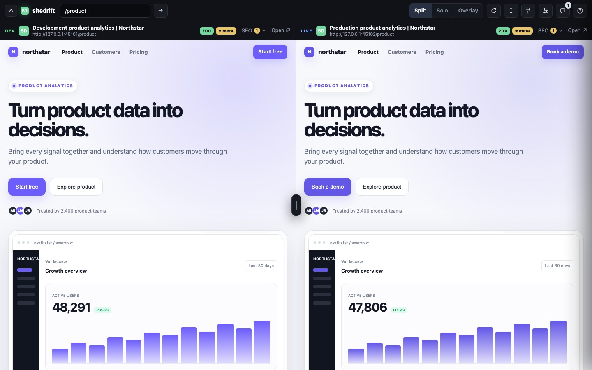
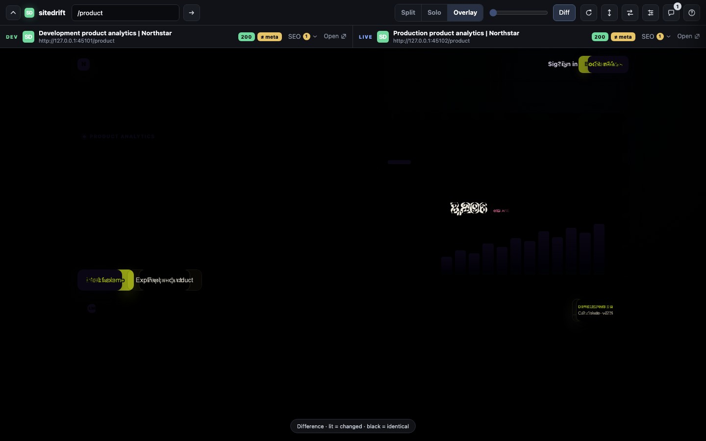
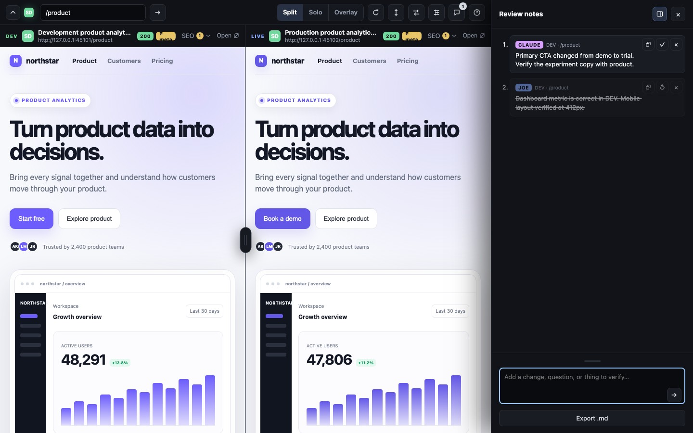
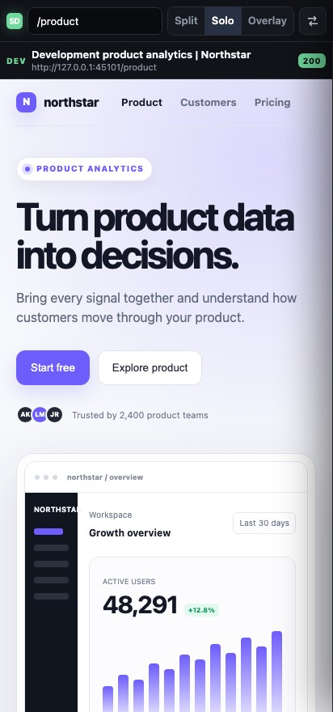

# sitedrift

**Catch the drift between dev and live.** A zero-build, zero-dependency dev tool
that frames your local site and production **side-by-side on the same route**,
locked to the same scroll — then overlays them in `difference` mode so the only
things that light up are the pixels that actually changed.

<p align="center">
  
</p>

<p align="center"><strong>Same route. Same scroll. Every change visible.</strong></p>

---

## Quick start

No install — run it with `npx` (needs Node ≥ 18):

```bash
npx sitedrift /pricing \
  --dev http://localhost:4321 \
  --live https://example.com \
  --open
```

That boots the viewer on `http://127.0.0.1:4178`, opens it at `/pricing`, and
puts your dev build on the left and production on the right. Type any route in
the toolbar and both panes follow.

Install it globally if you reach for it often:

```bash
npm i -g sitedrift
sitedrift /pricing -d http://localhost:4321 -l https://example.com -o
```

For a project you use repeatedly, add `sitedrift.config.json`:

```json
{
  "dev": "http://localhost:4321",
  "live": "https://example.com",
  "author": "joe",
  "open": true
}
```

Configuration precedence is **flag > environment > project file > default**.
The file is discovered from the current directory upward; `--config <file>`
selects one explicitly.

### HTTPS

The default (`http://127.0.0.1`) just works — loopback is a browser "secure
context", so you usually need nothing. When you do want HTTPS:

```bash
sitedrift --setup-https   # one-time: generate + trust a local cert
sitedrift --https         # serve over HTTPS from then on
```

`--setup-https` uses [mkcert](https://github.com/FiloSottile/mkcert) if it's
installed — that gives a **locally-trusted cert with zero browser warnings**. If
mkcert isn't found it falls back to an `openssl` self-signed cert and prints the
one command to trust it on your OS. Already have a cert? Skip all of this and
pass `--cert <file> --key <file>`.

### Cloudflare preview deployments

Turn every non-production Cloudflare Pages deployment into a compact sitedrift
review URL. The deployment opens its own preview in DEV Solo mode and can switch
to Split, Overlay, or Diff against the configured production site.

Install sitedrift and run the wrapper after your static build:

```json
{
  "scripts": {
    "build": "astro build && sitedrift cloudflare --dir dist --live https://example.com"
  },
  "devDependencies": {
    "sitedrift": "^0.3.0"
  }
}
```

Add one scoped Pages Function:

```ts
// functions/__sitedrift/[[path]].ts
export { onRequest } from 'sitedrift/cloudflare';
```

That is the entire integration. On Cloudflare Pages, the wrapper activates only
when `CF_PAGES=1` and `CF_PAGES_BRANCH` is not `main`. Production builds are
left unchanged. Use `--production-branch <name>` when production is another
branch.

Hosted proxies are read-only (`GET`/`HEAD`) and fixed to the configured live
origin. Frames run the compared site's scripts so interactive previews behave
like the deployment; only enable the addon for preview code you trust. Review notes stay in that
browser's `localStorage`; they are not sent to an API, shared with agents, or
written to disk. Existing application Functions keep their original routes.

---

## See the whole review loop

The included example compares a fictional Northstar release candidate against
production. It uses realistic release drift: primary CTA, metric values, and a
release badge change while the underlying layout stays aligned.

<table>
  <tr>
    <td width="50%">
      
      <br><strong>Pixel difference</strong><br>
      Overlay both pages and light up only what changed.
    </td>
    <td width="50%">
      
      <br><strong>Human + AI review channel</strong><br>
      Share route-specific findings through the viewer, CLI, or MCP.
    </td>
  </tr>
</table>

<p align="center">
  
  <br><strong>Focused mobile review</strong><br>
  Narrow screens default to Solo; Swap flips between DEV and LIVE.
</p>

Rebuild these screenshots from the deterministic local showcase:

```bash
npm run docs:screenshots
```

---

## What it does

- **One view switch** — Split (divider) · Solo (one pane, Swap flips) · Overlay
  (stacked). In Overlay an opacity slider blends the panes and **Diff**
  (`mix-blend-mode: difference`) lights up only the changed pixels. Overlay
  force-locks scrolling so the panes can't drift. Keys: `O` overlay, `D` diff.
- **Locked scrolling** with one controller (exact pixel or proportional) — no
  duplicate scrollbars, no bounce. An internal link click mirrors to both panes.
- **Metadata diff + status** — title / description / canonical compared across
  sides (`≠ meta`), and a per-pane `200/3xx/4xx/5xx/ERR` badge refreshed on every
  route load, so a route that 404s on one side jumps out.
- **SEO panel** — Google-style snippet preview + a ~13-point checklist per pane
  (title/description length, single H1, canonical, viewport, lang, Open Graph,
  noindex, image alt…), with a flag showing how many checks fail.
- **Review notes as a shared channel** — author/route/side-tagged notes in a JSON
  file the viewer polls every 4s, so a teammate or an AI coding session can leave
  notes that appear live. Click a note to jump to its route, copy a per-note
  deep link, dock or float the drawer, and **Send to vault** or export Markdown.
- **No runtime dependencies.** Node standard library only.
- **Deploy-preview mode for Cloudflare Pages.** Preview branches can carry the
  compact comparison toolbar without changing production output or application
  API routes.

### Keyboard

| Key | Action |
|---|---|
| `O` | Toggle Overlay |
| `D` | Toggle the Overlay difference blend |
| `S` | Swap sides |
| `R` | Reload both panes |
| `0` | Reset divider to 50/50 |
| `/` | Focus the route field |
| `Space` / `⇧Space` | Page down / up (when scrolling is linked) |
| `↑` `↓` | Line scroll both panes |
| `Esc` | Close the notes drawer / open popovers |

Shortcuts work whether focus is in the viewer chrome or inside either pane.

---

## Options

Every option is a CLI flag, and also reads a `SITEDRIFT_<NAME>` env var.

| Flag | Env | Default | Purpose |
|---|---|---|---|
| `-d, --dev <url>` | `SITEDRIFT_DEV` | `http://127.0.0.1:4321` | Left-pane (dev) origin. |
| `-l, --live <url>` | `SITEDRIFT_LIVE` | `https://example.com` | Right-pane (live) origin. |
| `-p, --port <n>` | `SITEDRIFT_PORT` | `4178` | Listen port. |
| `--host <addr>` | `SITEDRIFT_HOST` | `127.0.0.1` | Bind address. |
| `-o, --open` | — | off | Open the viewer in your browser. |
| `--https` | — | off | Serve HTTPS with an auto cert (mkcert if present, else openssl). |
| `--setup-https` | — | — | One-time: generate + trust a local cert, then exit. |
| `--http` | — | — | Force plain HTTP (the default; overrides `--https`). |
| `--cert <file>` / `--key <file>` | `SITEDRIFT_CERT` / `_KEY` | — | Bring your own cert; if both set, serve over HTTPS. |
| `--notes <file>` | `SITEDRIFT_NOTES` | `$TMPDIR/sitedrift-notes.json` | Shared review-notes file. |
| `--brand <text>` | `SITEDRIFT_BRAND` | — | Strip `\| <text>` from titles in pane headers. |
| `--author <name>` | `SITEDRIFT_AUTHOR` | `you` | Byline for notes added in the viewer. |
| `--vault <dir>` | `SITEDRIFT_VAULT` | — | Enable **Send to vault** (writes the review markdown here). |
| `--config <file>` | — | discovered | Read project configuration from JSON. |

A positional `[path]` (e.g. `sitedrift /pricing`) sets the initial route.
`-h, --help` and `-v, --version` do what you'd expect.

### AI and automation

The running process writes a private mode-`0600` descriptor under
`~/.sitedrift/sessions/`. The npm package includes a zero-dependency stdio MCP
server and an `AGENTS.md` operating guide.

Configure an MCP host with:

```json
{
  "command": "sitedrift-mcp",
  "args": []
}
```

Codex and Claude Code can register it directly:

```bash
codex mcp add sitedrift -- sitedrift-mcp
claude mcp add sitedrift -- sitedrift-mcp
```

Without a global install:

```json
{
  "command": "npx",
  "args": ["-y", "sitedrift", "mcp"]
}
```

Agents call `sitedrift_context` first, then use the note tools to share findings
with the user. The server also exposes `sitedrift://guide`, a `review_route`
prompt, and `sitedrift_setup` for install/config/HTTPS guidance.

For hosts without MCP, use the JSON CLI instead of scraping the viewer or
constructing authenticated requests:

```bash
sitedrift context
sitedrift notes list
sitedrift notes add "CTA differs" --route /pricing --side live --author codex
sitedrift notes resolve <id>
sitedrift notes reopen <id>
sitedrift notes remove <id>
sitedrift notes clear
```

Commands print JSON and return non-zero on failure. They work over HTTP or local
HTTPS without an agent-specific SDK.

### HTTP endpoints

| Route | Purpose |
|---|---|
| `GET /` | The viewer. |
| `GET /health` | `{ dev, live, version }`. |
| `GET /api/v1/session` | Authenticated session context and capabilities. |
| `GET /api/v1/notes` · `POST /api/v1/notes` | Authenticated note list / operations. |
| `GET /notes.md` | Notes as a Markdown checklist. |
| `POST /api/v1/notes/save` | Write notes markdown into `--vault`. |
| `GET /icon.svg` | The app mark / favicon. |
| frame ports: `GET /__dev/*` · `GET /__live/*` | Isolated proxied origins. |

The control API requires the per-session bearer token. The CLI commands above
are the supported machine interface.

Most viewer state (route, layout, scroll mode, focus) is mirrored into the URL
query string, so a link reproduces the exact view.

---

## Security — local development only

The proxy strips `Content-Security-Policy`, `X-Frame-Options`, and the
Cross-Origin-{Embedder,Opener,Resource}-Policy headers so production can be
framed next to dev.

- Only loopback hosts are accepted, and Host headers are validated.
- The viewer/control API uses `--port`; DEV and LIVE frames use `--port + 1`
  and `--port + 2`, so neither page can inspect the other.
- Framed pages communicate through a narrow `postMessage` bridge and cannot
  access the viewer DOM, bearer token, notes API, or vault endpoint.
- Treat the notes file as plaintext shared scratch space.

## Development

```bash
npm test
npm run test:e2e:visual
npm run test:e2e:visual:update   # intentionally accept visual changes
```

The visual suite uses deterministic origins and checked-in Chromium baselines
for desktop split, narrow Solo, difference overlay, and the notes drawer.

## Limitations

- **URL rewriting is regex-based**, tuned for static sites (e.g. Astro builds).
  It rewrites root-relative `href`/`src`/`srcset`/`url(...)` and Vite/`_astro`
  paths, but won't catch URLs built in JS (`fetch`, dynamic `import`, import
  maps). SPAs with client-side absolute fetches may need extra rules.
- Designed for two origins of the *same* site, not arbitrary cross-site diffing.

---

## Docs

- [`docs/ARCHITECTURE.md`](docs/ARCHITECTURE.md) — internals, invariants, and the
  module map.

## Credits

Created by [Joe Severino](https://github.com/joeseverino).

## License

[MIT](LICENSE) © 2026 Joe Severino
