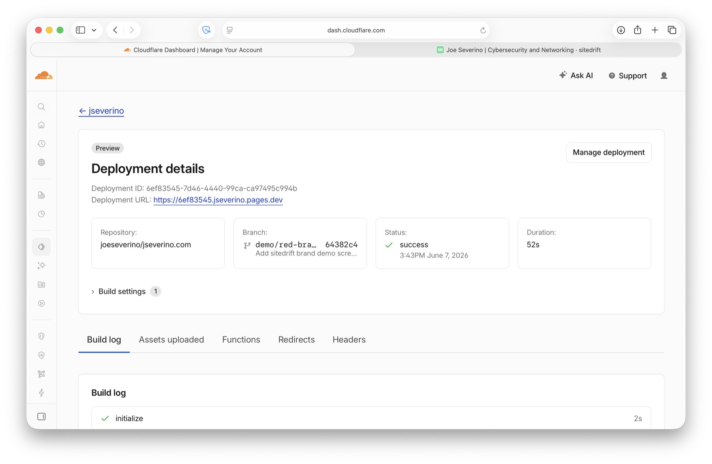
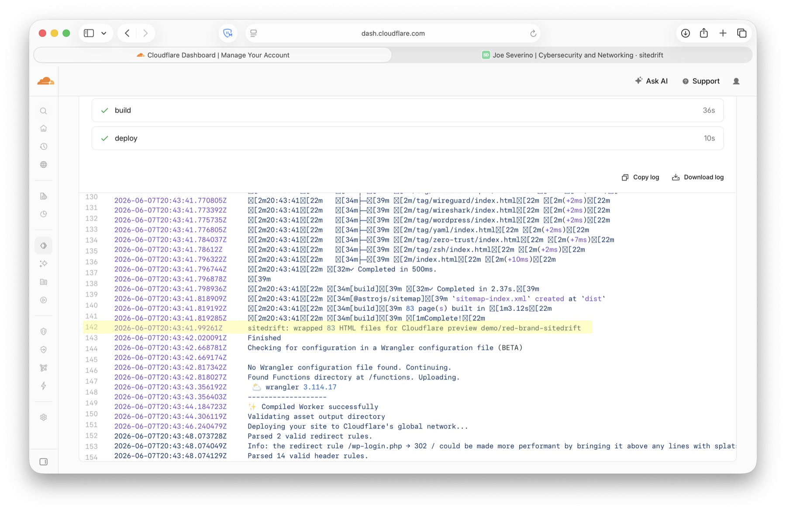
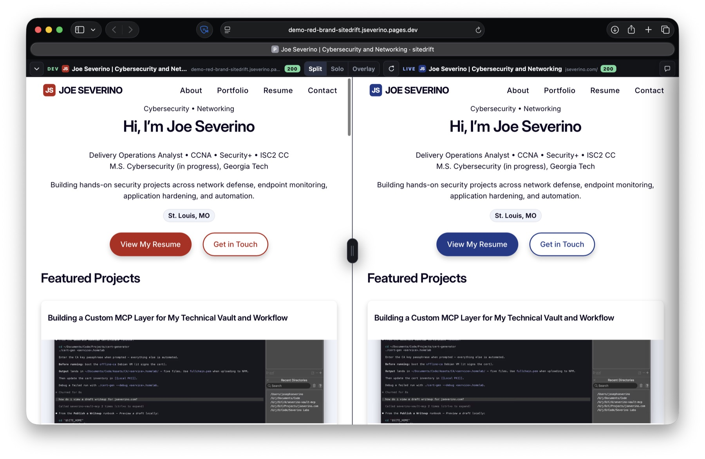

# Cloudflare Pages preview addon

Add sitedrift to non-production Cloudflare Pages deployments in two project
changes. Production builds remain byte-for-byte unchanged.

## 1. Install and wrap the static build

```bash
npm install --save-dev sitedrift@latest
```

Run the wrapper after the framework build. Replace `dist` with your output
directory and `https://example.com` with the production origin:

```json
{
  "scripts": {
    "build": "astro build && sitedrift cloudflare --dir dist --live https://example.com"
  }
}
```

The command works with any static framework:

| Framework | Build command |
|---|---|
| Astro | `astro build` |
| Vite | `vite build` |
| Eleventy | `eleventy` |
| Static HTML | your existing command |

## 2. Add the scoped Pages Function

Create `functions/__sitedrift/[[path]].ts`:

```ts
export { onRequest } from 'sitedrift/cloudflare';
```

Commit and push a non-production branch. Its Pages URL opens in compact DEV
Solo view and can switch to Split, Overlay, or Diff against production.

## What the deployment looks like

The integration uses the normal Pages build. Cloudflare records the repository,
branch, commit, success state, duration, and immutable URL for the reviewed
artifact:

[](https://6ef83545.jseverino.pages.dev/)

After the framework creates its static output, sitedrift transforms the preview
in place. This real build produced 83 HTML files and then printed:
`sitedrift: wrapped 83 HTML files for Cloudflare preview ...`



The resulting deployment opens directly into sitedrift and compares that
specific preview with the configured production origin:

[](https://6ef83545.jseverino.pages.dev/)

This demonstration uses an immutable `*.pages.dev` URL, so it remains pinned to
the reviewed commit even after the branch changes.

## Production guard

The wrapper activates only when all of these are true:

- `CF_PAGES=1`
- `CF_PAGES_BRANCH` is present
- the branch is not `main`

If production uses another branch:

```bash
sitedrift cloudflare --dir dist --live https://example.com --production-branch production
```

On the production branch, sitedrift returns without changing the build output
or creating its internal files.

## Security model

- The Function owns only `/__sitedrift/*`.
- It accepts only `GET` and `HEAD`.
- The LIVE proxy is fixed to the `--live` origin.
- Existing Pages Functions and application APIs retain their routes.
- Preview pages are marked `noindex`.
- Hosted notes stay in that browser's `localStorage`.
- Compared preview scripts execute inside the frames, so enable the addon only
  for preview code you trust.

No Cloudflare dashboard settings, environment variables, Worker bindings, or
production route changes are required.

## CI check

To prove the production guard in your own project:

```bash
CF_PAGES=1 CF_PAGES_BRANCH=main npm run build
test ! -e dist/__sitedrift
```
